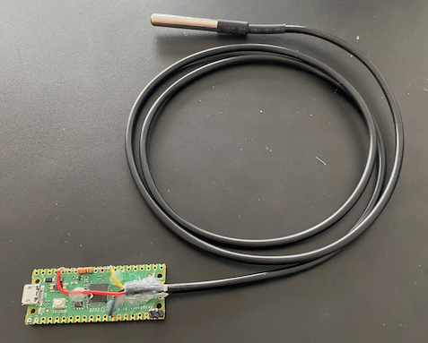
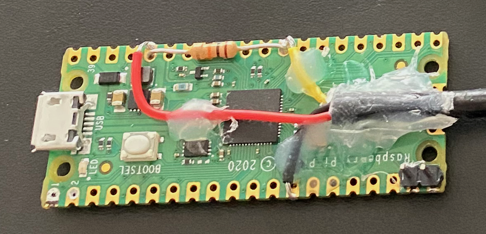
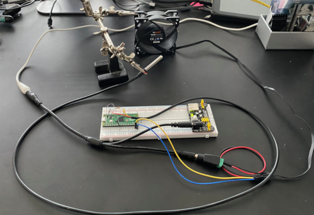
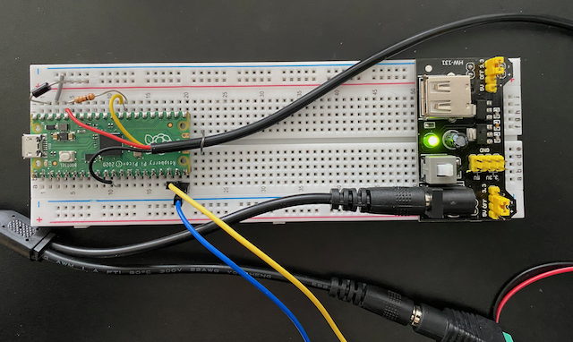
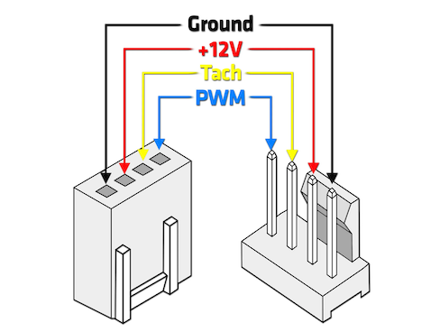

# PID Fan Controller
## Goal
Maintain a given temperature inside a case using PWM fans, a PID regulator and a temperature probe.
## Objectives
* Regulate temperature in case indpendently of the main computer.
* Build fan controller out of inexpensive and commonly available parts.
* Learn more about electronics by building a simple electronic device.

## Build

TODO document the steps for building the fan controller

## Notes

### Powering the fan controller in the lab setup
The biggest challenge was to power the lab setup where the fan controller runs outside a computer case. Consider the following:

* A single power source should power both the PWM fan and the Pico as they must share the same ground.

* The PWM fan requires 12V but the Pico runs only on 5V on the Micro-USB connector or between 1.8V and 5.5V on VSYS (pin 39).

Using a single power source for Pico and Fan turned out to be fairly straight forward and was solved by splitter cable that divided the power between the fan and a 12V to 3.3V DC converter.

A further complication occurs as the Pico must be connected to the computer through the Micro-USB connecter when uploading/running programs in the lab Pico.

If an external power source is connected at the same time as the computer, the computer and/or the Pico risks getting damaged.

The following video tutorial [Power to the Pico](https://www.youtube.com/watch?v=3PH9jzRsb5E) explains how to mitigate this risk by connecting a rectifier diode between VSYS and the external power supply.

    In spite of using the rectifier diode I managed to damage the Micro-USB
    connector so that i now emits a high frequency noise when connected to the
    computer. The Pico still works when connected to external power. This was
    either due to user error, or somehow the diode did not work as expected.

### Powering the fan controller in the computer case
Powering the device inside the computer case was simpler than in the lab setup.

All that is required is a cable that converts 4 pin Molex socket into a Micro-USB connector as the Molex connector provides both 12V and 5V pins and the ground is shared with the rest of the computer, including the fans. Only ground and the 5V pins need to be connected to the Micro-USB connector.

### Measuring temperature
Measuring temperature using the DS18B20 temperature probe is fairly straight forward using standard MicroPython librarires.

The main considerations are

* The selected probe uses the OneWire protocol. To use the probe, it must be "pulled" using a suitable resistor connecting sensor wire to power. A 10kΩ resistor was found to work fine.

* The temperature probe requires 750ms between converting and reading the temperature.

In the current version of the fan controller program, this time is spent sleeping, but future iterations could see the time being used for something productive.

### Tuning the PID controller
The main challenge in using a PID controller is finding the right gains, i.e. the values of $k^p$, $k^i$ and $k^d$.

Part of the challenge is that the lab setup is not a faithful model for the dynamics of case temperature and fans, and with badly tuned values and the fan control will take time to reach a steady state or become unstable.

The standard tip is to first zeroing all three gains and then to slowly increase the proportional gain, followed by the integral and derivative gains one at a time.

A rule of thumb is to use a proportional gain equal to half the value for which the system starts to oscillate.

    Still figuring out what the correct gains are for my specific system.

## Improvements

The fan controller must be disconnected from the computer case to update the program and/or program parameters.

This makes tuning a hassle. Tuning using the lab setup, at best only gives ballbark values of the parameters.

The following improvements are planned before the first version of the fan controller can be considered done:

* Connectors should be introduced to facilitate connecting and disconnecting the PID controller from the probe. Without this it is not feasible to mount the probe in a fixed position.

* The two JST pins should be replaced by a four-pin socket fitting the standard computer fan plug.

## Roadmap

### Version 1.0

 - [ ] add connector to temperature probe
 - [ ] replace JST pins with fan connector
 - [ ] use ambient temperature as lower bound for target temperature

### Version 1.1 - tuning over serial interface

 - [ ] plot temperature, signal and PID components dynamically on a graph
 - [ ] dynamically update gains constants
 - [ ] dynamically update temperature target

### Version 2.0 - human interface

 - [ ] display temperature using a display
 - [ ] control temperature target using a rotary encoder

## Reflections

### In situ PID tuning
It is clear that the PID controller must be tuned in situe, i.e. when mounted inside the case. It would also be useful to plot the value in a graph.

To accomplish this the following options can be envisaged:

* Connect the Micro-USB interface to to a computer while the fan controller is mounted in the case, is connected to the fans, and find a way to plot the values in real-time.

* Switching to a Raspberry Pico W that provides a web page with one or more graphs of the signal, the contribution for each of the P, I and D components and fields for dynamically updating the $k^p$, $k^i$, and $k^d$ constants.

The first option is preferred as it keeps the regulator simpler and does not expose the fan controller to a Wifi network. Exposing the controller to a WiFi network raises security questions and management isues.

However the first option must ensure that fan controller, computer running the case fans and the tuning computer are electrically safe, cf. the issues about powering the Pico in the lab setup.

If the computer used for the tuning is the computer in the case, there should be no electrical issue.

### Auto-tuning

Commercial PID regulators often support auto tuning. This sounds (very) useful but requires further investigation.

### Controller interface

Once the gains have been configured it would be nice to with a display that shows the target and current temperature and where the target temperature can be set.

A simple seven segment LED with four digits and a rotary encoder with a button function would work fine, the main issue is how to integrate it in the case in a good way.

Possibly the display and capacitive buttons could be mounted on the inside of a glass panel of the case.

## Hardware
### Bill of Materials
#### Fan controller

TODO add fan controller schema image

* Raspberry Pico
* DS18x20 temperature probe
* 10 kΩ resistor
* 2 JST header pins
* 5 mm solder
* MicroUSB to 4-pin Molex socket cable converter (not shown)

#### Fan controller lab

TODO add fan controller schema image with fan and power supply

* Raspberry Pico H
* 80mm PWM fan
* DS18x20 temperature probe
* 10 kΩ resistor
* Rectifier diode (1N4007)
* 12V DC power source with barrel plug
* 12V-5/3.3V DC power converter
* 5 mm female to two male DC barrel plug splitter cable
* 5 mm female DC barrel plug to terminal connector
* Breadboard
* Dupont jumpers

### Bill of Materiels

* Soldering iron
* Glue gun

### Sourcing

Biggest challenge for a small hobby project is to source electronic components without paying high unit costs for low volumes and without incurring signficant surcharges from courier services.

Prices vary signficantly between vendors of the same component as buying in bulk and reselling with a very high markup seems to be a dominant business model. It is very easy to tricked into paying too much for a component.

#### Kits

Several of the componentsin in this project came from a single starter kit:

* [BOJACK 37](https://www.amazon.de/dp/B09DCB5D9N?psc=1&ref=ppx_yo2ov_dt_b_product_details) (€14.28)

 The resistor came from an old kit not documented here. I particularily like the 12V-5/3.3V DC power converter in the BOJACK 37 kit.

#### Components

* [Raspberry Pico](https://thepihut.com/products/raspberry-pi-pico) (€3.09)
* [Raspberry Pico H](https://thepihut.com/products/raspberry-pi-pico?variant=41925332566211) (€3.80)
* [be quiet! Pure Wings 2](https://www.digitec.ch/en/s1/product/be-quiet-pure-wings-2-80-mm-1-x-pc-fans-5813357?supplier=406802) (12.71 CHF ~ €12)
* [Micro USB to 4-Pin Molex Socket Cable (0.5m)](https://thepihut.com/products/micro-usb-male-to-4-pin-molex-socket-cable-0-5m) (€3.17)
* 12V DC power source sourced from old router

#### Bulk components
* [DZYDZR 2 Pack 5.5 x 2.1mm DC 12V Adapter Cable Power Female to Male](https://www.amazon.de/dp/B01KCQVMKI?ref=ppx_yo2ov_dt_b_product_details&th=1) (€5.87)
* [kwmobile 10 x DC Sockets, 10 x DC Connectors](https://www.amazon.de/dp/B06XPVJT1Z?psc=1&ref=ppx_yo2ov_dt_b_product_details) (€7.81)
* [COVVY DS18B20 Stainless Steel Temperature Probe](https://www.amazon.de/dp/B07TKTFKMW?psc=1&ref=ppx_yo2ov_dt_b_product_details) (€8.99)

#### Tools
* [PINECIL v2 soldering iron](https://pine64.com/product/pinecil-smart-mini-portable-soldering-iron/) ($25.99 ~ €24)
* Old glue gun sourced from the tool box...

## Software
MicroPython is chosen for ease of use. All the libraries used for the fan controller are included in the standard MicroPython distribution.

* [MicroPython](https://micropython.org/) (v1.19.1)
* [Visual Studio Code](https://code.visualstudio.com/) with the [Pico-W-Go](https://marketplace.visualstudio.com/items?itemName=paulober.pico-w-go) (v2.1.8) extension

To install the MicroPython distribution on the Pico, [Thonny](https://thonny.org/) was used.

## Theory
### PWM fan control
PWM (Pulse Width Modulation) is a way of controlling electrical devices.
* A carrier wave runs a given frequency
* The duty cycle is the width of the pulse in each period

The duty cycle can be expressed as a percentage of the full period, where 0% is effectively off and 100% is, well, running at 100%. For a duty cycle of 50% the pulse is symmetrical, i.e. off half half the time of the period and on for the remaining half.

Note that the amplitude of the pulse should not matter as it is only used to enable a variable amount of current using a transistor.

TODO illustrate PWM duty cycle of 0, 25, 50, 75 and 100%

TODO add schema for how power is transmitted to the fan.

### PID regulator
A PID regulator can in the general and simplest case be described by the following mathematical expression:

$$\begin{cases}
S_0 = 0 \\
S_n = k^p E_{n} + k^i \sum_0^n E_m + k^d (E_n - E_{n-1}) \\
\\
E_n = T^t - T_n \\
\\
n = 1, 2, 3, ... \\
\end{cases}$$

... where each iteration _n_ of a regulator loop produces a singal ($S$) as a function of the error ($E$) between the current ($T$) and desired ($T^t$) state of a measured value controlled by the signal.

The signal is composed of a proportional ($P$), integral ($I$) and derivative ($D$) term. The corresponding _gains_ ($k^p$, $k^i$, and $k^d$) indicate how much weight to give to each term of the signal.

As the derivative part is sensitive to minute variations in the measured value, and thus may cause undesired variations in the signal, the derivative gain is often set to zero and effectively eliminating the derivative term. This is usually referred to as a PI regulator.

### PWM fan control using a PID regulator

In our case we want to control a PWM case fan based on the temperature measured inside a computer case. We have the following considerations:

* The signal (duty cycle) is expressed as a fraction of 65535.
* The signal is inversed in regard to the nominal regulator
* There is a minimal desired signal at which the fan should operate.
* The target temperature should greater than the ambient temperature in the room.
* Integral windup should be addressed.

The first point is simply dictated by PWM library used for the Raspberry Pico.

The second point can be explained by the fact that a temperature higher than the target should result in an increased signal output as we need to increase the cooling effect of the fan and  temperature lower than the target should result in a decreased output signal as the cooling effect of the fan is probably too high.

Regarding a minimial fan speed, this is a user setting ranging from zero (off) to some arbitrary value for keeping the fan going at all times, albeit at a low speed.

Although there might be a windchill effect when using a fan it is not desirable to try to cool the case to temparature below that of the room in which the computer is operating. Doing so likely means having the fans running on maximum power all the time, preemptying the goal of using a PID fan control.

As for [integral windup](https://en.wikipedia.org/wiki/Integral_windup) this is an effect where it takes very long for the regulator to reach its value, which may make the integral sum too large. In our case the, it takes a long time for the temperature probe to adjust to the air temperature.

There are several ways to handle integral windup, and for this implementation we will limit limit the integral sum to an integer between the negative and positive value of the maximum signal.

In summary we get the following modified PID equation system:

$$\begin{cases}
S^{min} = 0 \\
S^{max} = 65535 \\
\\
S_0 = S^{min}\\
S_n = P_n + I_n + D_n & \text{where } S_{min} ≤ S_n ≤ S_{max} \\
\\
P_n = k^p E_{n} \\
I_n = k^i \sum_0^n E_m & \text{where } |I_n| ≤ S_{max} \\
D_n = k^d (E_n - E_{n-1}) \\
\\
T^t_n = \max(T^t,T^{amb}_{n}) \\
E_n = T_n - T^t_n & (\text{inversed error}) \\
\\
n = 1, 2, 3, ... \\
\end{cases}$$

## References
* [How to Tune a PID Controller](https://pidexplained.com/how-to-tune-a-pid-controller/)

* [Ziegler–Nichols method](https://en.wikipedia.org/wiki/Ziegler%E2%80%93Nichols_method) (Wikipedia) for tuning PID regulators.

* [Raspberry Pi Documentation - MicroPython](https://www.raspberrypi.com/documentation/microcontrollers/micropython.html)
* [Interfacing DS18B20 Sensor with Raspberry Pi Pico](https://how2electronics.com/interfacing-ds18b20-sensor-with-raspberry-pi-pico/)
* [Power to the Pico](https://www.youtube.com/watch?v=3PH9jzRsb5E) - safely connect pico to computer and external power source at the same time.
* [Raspberry Pi Pico Onboard Temperature Sensor Tutorial Using MicroPython](https://electrocredible.com/raspberry-pi-pico-temperature-sensor-tutorial/)
* [Molex Disk connector](https://en.wikipedia.org/wiki/Molex_connector) (Wikipedia)

* Four-pin fan header

TODO: add reference on PWM and optimal frequency for case fans.
